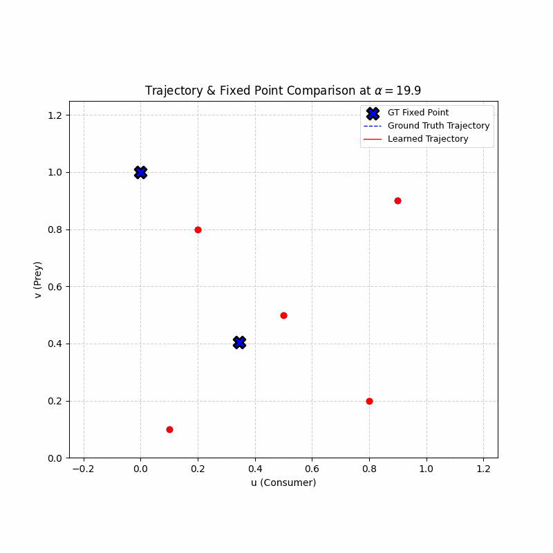

# Structural Instability of Neural ODEs Near Bifurcations and Invariant Boundaries

**Status:** Manuscript in Preparation (Dec 2025)  
**Author:** Nasser Mohammed  
**Topic:** Scientific Machine Learning (SciML), Dynamical Systems, Bifurcation Theory

## Abstract
Neural Ordinary Differential Equations (Neural ODEs) have emerged as a powerful tool for system identification, but their topological fidelity near critical transitions remains unclear. In this study, we investigate the learnability of **Saddle-Node Bifurcations** (specifically the "ghost" region) in a reaction-diffusion system.

We demonstrate that this inability to learn complex vector fields is not due to a lack of data, but rather an inherent limit of neural ODEs. We analyze a system near a saddle-node bifurcation, characterizing 3 distinct fixed point topologies (no fixed point => non-hyperbolic fixed point => sink and saddle). We then train a neural ODE for each parameter range, and for increasing amounts of data. This also highlights how vector fields with less fixed points can sometimes require more data, due to ghost dynamics. Finally, this also highlights a difficulty in trusting neural ODEs, as the loss converges to 0 in all of these scenarios, however, the true fixed point topology is far off. Furthermore, the neural ODE struggles with keeping its trajectories bounded in the invariant region, even if the vector field looks accurate.


## 1. The Problem: Ghost Dynamics and Global Structure
Biological systems often operate near tipping points characterized by **Saddle-Node** bifurcations. These regions exhibit "ghost" dynamics where the trajectory slows down algebraically ($O(t^{-1})$). Furthermore, many of these systems are only biologically relevent for certain invariant regions. A common example is when the differential equations model
concentrations of a species, which is naturally bounded in $[0,1]^n$. Neural ODEs of this type will only be trained on data that the user can obtain (i.e. in $[0,1]^n$), however, we will see that neural ODEs can fail to maintain this invariant region, invalidating the dynamics they produce.

We found that standard Neural ODEs struggle with simultaneously capturing the local dynamics of fixed points near bifurcations, as well as the invariant region boundaries. We hypothesize that this is due to the relationship between invariant regions and their isolated structure with respect to a global vector field. Furthermore, the dynamics near saddle-node bifurcations are highly sensitive, making approximation a challenge. 

### The System
We analyze a custom derived Predator-Prey model which has the following features:
- Forward invariant on the unit square $[0,1]^2$.
- Saddle-node bifurcation as the parameter $\alpha$ is shifted through the 3 distinct regions: $ \alpha < 20, \alpha = 20, \alpha > 20$. The existence of fixed points near the point $(0, 0.2)$ dissapears for $\alpha < 20$.
- Persistent limit cycle near $(0,0.2)$. The unstable spiral that generate this fixed point is centered around $(0.34, 0.406)$.
- A persistent boundary saddle node at $(0,1)$, which helps maintain the limit cycle.

  The model is given by this coupled reaction-diffusion system:

 $$
\frac{du}{dt} = \frac{10u(1-u)}{1+e^{-12(v-0.4)}} - \frac{4u}{1+e^{-12(0.55-v)}}
$$
$$
\frac{dv}{dt} = \alpha v(1-v)(v-0.4) + 0.8(1-v) - 3.6 uv
$$


## 2. Key Results

As mentioned, the system has 3 distinct regimes that we are training on: 
1) ($\alpha = 19.9$) This system has a limit cycle, an unstable spiral at $(0.34, 0.406)$, and a saddle at $(0,1)$. It is here where we see ghost dynamics near $(0, 0.2)$.
2) ($\alpha = 20$) This system has a limit cycle, an unstable spiral at $(0.34, 0.406)$, a saddle at $(0,1)$, and a non-hyperbolic equilibrium at $(0, 0.2)$.
3) ($\alpha = 20.1$) This system has a limit cycle, an unstable spiral at $(0.34, 0.406)$, a saddle at $(0,1)$, a sink at $(0, 0.186)$, and a saddle node at $(0, 0.214)$. This last saddle node defines the boundary between the basin of attraction for the two main attractors: the limit cycle and the sink.

We train and compare these systems for varying amounts of data from fifty to five million (50, 500, 5000, 50000, 500000, 50000000) data points. The results are below: 

### Samples = 50
$\alpha = 19.9$



### Samples = 500

### Samples = 5000

### Samples = 50000

### Samples = 500000

### Samples = 5000000

## 4. Conclusion
Our results suggest that **standard MLP architectures are mathematically incapable** of representing SNIC bifurcations without introducing structural instability. The piecewise-linear inductive bias forces the model to trade off between capturing the slow manifold (ghost) and the fast manifold (limit cycle); it cannot satisfy both simultaneously.

Future work must move beyond loss function engineering and explore **Rational Networks** or **Bifurcation-Informed Priors** to enforce polynomial degeneracy constraints.

---

## Project Structure
* `system_definitions.py`: PyTorch implementation of the Predator-Prey system.
* `train_ablation.py`: Script to run the full suite (MSE, Weighted, Sobolev, L-BFGS).
* `visualize.py`: Generates the phase portraits and animations.

## Usage
To reproduce the failure analysis:
```bash
python train_ablation.py --mode lbfgs --visualize
